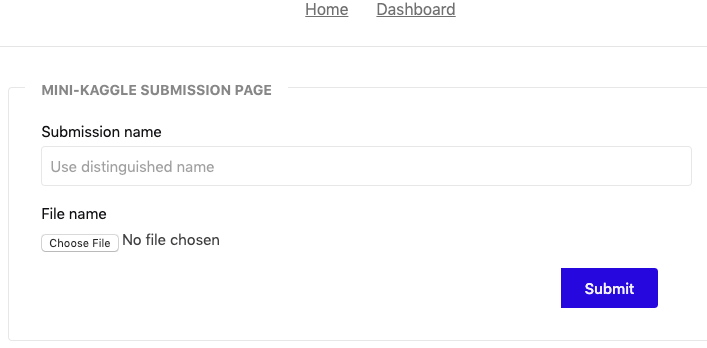

### Mini-Kaggle web services

[](https://travis-ci.org/vkuznet/mini-kaggle)
[](https://goreportcard.com/report/github.com/vkuznet/mini-kaggle)
[](https://godoc.org/github.com/vkuznet/mini-kaggle)

A Mini-Kaggle is [Kaggle](https://www.kaggle.com) inspired web service
with minimalistic interface. It can be used for DataScience classes,
small projects, or just for fun, to host user scores based on ML
predictions.

Scores are kept in [SQlite](https://sqlite.org/index.html) database.

### Build, run instructions
To build and run the service you need Go-language and follow these steps:
```
# download source code
git clone https://github.com/vkuznet/mini-kaggle
cd mini-kaggle

# download appropriate SQL DB driver, e.g. SQLite
go get github.com/mattn/go-sqlite3

# download gonum package
go get github.com/gonum/stat
go get github.com/gonum/integrate

# build the server
go build

# adjust server.json configuration file with your settings

# run the service
./mini-kaggle -config server.json

# navigate to your service, e.g. (if it runs on port 8888, see server.json)
http://localhost:8888
```
### Interface


